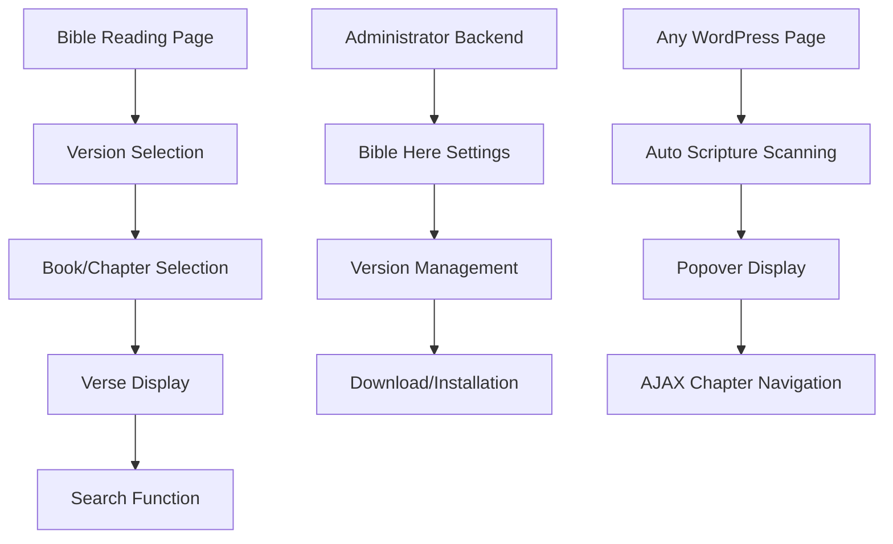

# Bible Here WordPress Plugin - Product Requirements Document

## 1. Product Overview

Bible Here is a WordPress plugin specifically designed for Christian communities, providing multilingual Bible reading, comparison, search, and commentary features. The plugin supports responsive design for both mobile and desktop devices, enabling users to conveniently read and study Bible content.

The plugin will be published in the official WordPress.org plugin repository, providing professional Bible reading solutions for Christian websites worldwide, supporting multiple Bible versions, commentaries, cross-references, and Strong Numbers for academic research purposes.

## 2. Core Features

### 2.1 User Roles

| Role | Registration Method | Core Permissions |
| ------------- | ------------------- | ----------------------- |
| Guest User | No registration required | Can browse Bible, search verses, use basic reading features |
| WordPress Administrator | WordPress backend login | Can install Bible versions, manage plugin settings, enable verse highlighting features |

### 2.2 Feature Module

Our Bible Here plugin includes the following main pages:

1. **Bible Reading Page**: Bible version selector, book/chapter navigation, verse display area, search functionality
2. **Administrator Settings Page**: Bible version management, download/installation interface, plugin feature settings
3. **Verse Highlighting Feature**: Automatic scripture abbreviation recognition, Popover/Dialog display, AJAX chapter navigation

### 2.3 Page Details

| Page Name | Module Name | Feature Description |
| --------- | ------------ | ---------------------------------------------- |
| Bible Reading Page | Version Selector | Provides dropdown menu to select different languages and versions of Bible, supports multi-version side-by-side comparison |
| Bible Reading Page | Book/Chapter Navigation | Provides book list and chapter selector, supports quick jump to specific verse locations |
| Bible Reading Page | Verse Display Area | Responsive verse display, side-by-side on desktop, stacked on mobile, includes commentary buttons |
| Bible Reading Page | Search Function | Full-text search of verse content, supports keyword highlighting and result pagination |
| Administrator Settings Page | Bible Version Management | Lists installed and downloadable Bible versions, supports import from Zefania XML format |
| Administrator Settings Page | Download/Installation Interface | Downloads XML Bible files from GitHub remotely, automatically parses and imports to database |
| Administrator Settings Page | Feature Settings | Enable/disable verse highlighting feature, configure Popover display options |
| Verse Highlighting Feature | Auto Recognition | Uses Regex to scan page content, automatically identifies Bible abbreviations and adds markup |
| Verse Highlighting Feature | Popover Display | Shows complete verse content when clicking scripture abbreviations, supports HTML Popover API |
| Verse Highlighting Feature | AJAX Navigation | Provides previous/next chapter buttons in Popover, no page reload required |
| Verse Highlighting Feature | Shortcode Support | Supports manual \[bible-here ref="Gen1:1"] shortcode verse markup |

## 3. Core Process

**Guest User Flow:**
User enters Bible reading page → Selects Bible version → Chooses book and chapter → Reads verse content → Optionally searches for specific verses → Clicks commentary button to view detailed explanations

**Administrator Flow:**
Administrator logs into WordPress backend → Enters Bible Here settings page → Views downloadable Bible version list → Selects and downloads XML files → System automatically imports and creates data tables → Enables verse highlighting feature → Configures Popover display options

**Verse Highlighting Flow:**
User browses any WordPress page/post → System automatically scans and identifies scripture abbreviations → User clicks highlighted scripture → Popover displays complete verse → User can click buttons to browse previous/next chapters

## 4. User Interface Design

### 4.1 Design Style

* **Primary Colors**: Dark blue (#2C3E50) as main color, gold (#F39C12) as accent color

* **Button Style**: Rounded button design with subtle shadow effects

* **Typography**: Prioritize system fonts, Chinese uses Microsoft YaHei or PingFang, English uses Arial or Helvetica

* **Layout Style**: Card-based design, top navigation bar, left sidebar book menu, main content area

* **Icon Style**: Use Font Awesome icon library, clean modern line style

### 4.2 Page Design Overview

| Page Name | Module Name | UI Elements |
| --------- | ----------- | ------------------------ |
| Bible Reading Page | Version Selector | Dropdown menu style, supports search filtering, displays language and version names |
| Bible Reading Page | Book Navigation | Left collapsible menu, grouped by Old/New Testament, supports quick search |
| Bible Reading Page | Verse Display | Card-based layout, verse numbers left-aligned, content area fully utilizes space |
| Administrator Settings Page | Version Management | Table-style list, includes installation status, version info, action buttons |
| Verse Highlighting Feature | Popover | White background, subtle shadow, rounded border, includes title and navigation buttons |

### 4.3 Responsiveness

The plugin adopts mobile-first responsive design:

* **Desktop**: Supports dual-column side-by-side display of different Bible versions, fixed left navigation

* **Tablet**: Adaptive layout, navigation collapses to hamburger menu

* **Mobile**: Single-column stacked display, touch-optimized buttons and menus

* **Touch Optimization**: All interactive elements support touch operations, appropriate touch target sizes

