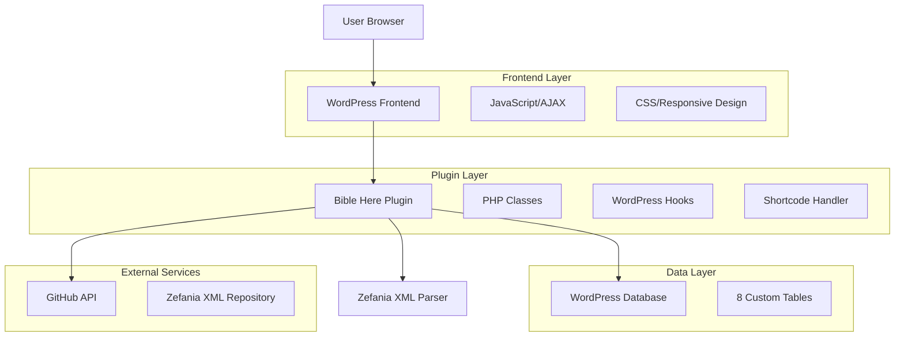
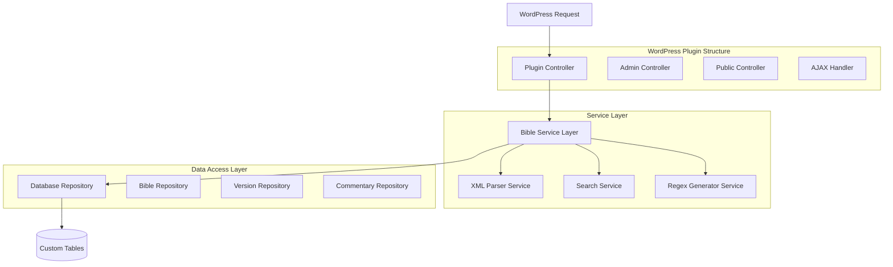
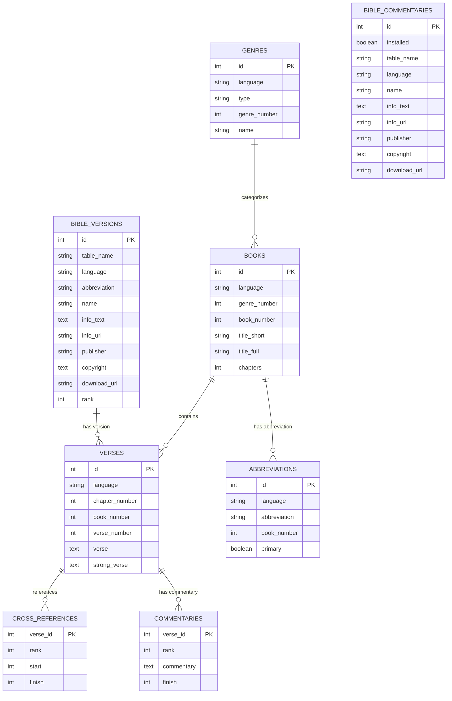

# Bible Here WordPress Plugin - Technical Architecture Document

## 1. Architecture Design



## 2. Technology Description

* **Frontend**: JavaScript (ES6+) + CSS3 + HTML5 Popover API

* **Backend**: PHP 7.4+ + WordPress Plugin API

* **Database**: MySQL 5.7.6+ / MariaDB 10.2.6+ (utf8mb4, InnoDB) or MariaDB + Mroonga Engine

* **External APIs**: GitHub API for XML file downloads

* **Standards**: WordPress Plugin Boilerplate structure

## 3. Route Definitions

| Route                                        | Purpose                                                                        |
| -------------------------------------------- | ------------------------------------------------------------------------------ |
| /bible-reader                                | Main Bible reading interface, displays verse content and navigation            |
| /wp-admin/admin.php?page=bible-here          | Administrator settings page, manages Bible versions and plugin settings        |
| /wp-admin/admin.php?page=bible-here-versions | Bible version management page, downloads and installs new versions             |
| /wp-admin/admin.php?page=bible-here-settings | Plugin feature settings page, configures verse highlighting and other features |

## 4. API Definitions

### 4.1 Core API

**Get Bible Verses**

```
POST /wp-admin/admin-ajax.php
Action: bible_here_get_verses
```

Request:

| Param Name   | Param Type | isRequired | Description                             |
| ------------ | ---------- | ---------- | --------------------------------------- |
| version      | string     | true       | Bible version abbreviation (e.g. 'kjv') |
| book         | integer    | true       | Book number (1-66)                      |
| chapter      | integer    | true       | Chapter number                          |
| start\_verse | integer    | false      | Starting verse number                   |
| end\_verse   | integer    | false      | Ending verse number                     |

Response:

| Param Name | Param Type | Description                        |
| ---------- | ---------- | ---------------------------------- |
| success    | boolean    | Whether the request was successful |
| data       | array      | Verse data array                   |
| verses     | array      | Verse content                      |

**Search Verses**

```
POST /wp-admin/admin-ajax.php
Action: bible_here_search_verses
```

Request:

| Param Name | Param Type | isRequired | Description                |
| ---------- | ---------- | ---------- | -------------------------- |
| query      | string     | true       | Search keywords            |
| version    | string     | true       | Bible version abbreviation |
| limit      | integer    | false      | Result limit (default 50)  |

**Download Bible Version**

```
POST /wp-admin/admin-ajax.php
Action: bible_here_download_version
```

Request:

| Param Name    | Param Type | isRequired | Description                |
| ------------- | ---------- | ---------- | -------------------------- |
| download\_url | string     | true       | XML file download link     |
| version\_info | object     | true       | Version information object |

**Get Verse Highlighting Regex**

```
GET /wp-admin/admin-ajax.php
Action: bible_here_get_regex
```

Response:

| Param Name    | Param Type | Description                                                |
| ------------- | ---------- | ---------------------------------------------------------- |
| regex         | string     | Regular expression for identifying scripture abbreviations |
| abbreviations | array      | Abbreviation mapping table                                 |

## 5. Server Architecture Diagram



## 6. Data Model

### 6.1 Data Model Definition



### 6.2 Data Definition Language

**Books Table (wp\_books)**

```sql
CREATE TABLE wp_books (
    id INT AUTO_INCREMENT PRIMARY KEY,
    language VARCHAR(10) NOT NULL,
    genre_number TINYINT NOT NULL,
    book_number TINYINT NOT NULL CHECK (book_number BETWEEN 1 AND 66),
    title_short VARCHAR(20) NOT NULL,
    title_full VARCHAR(100) NOT NULL,
    chapters TINYINT NOT NULL CHECK (chapters BETWEEN 1 AND 150),
    UNIQUE KEY unique_book (language, book_number),
    INDEX idx_book_number (book_number),
    INDEX idx_language (language)
) ENGINE=InnoDB DEFAULT CHARSET=utf8mb4 COLLATE=utf8mb4_unicode_ci;
```

**Verses Table (wp\_en\_kjv - example)**

```sql
CREATE TABLE wp_en_kjv (
    id INT AUTO_INCREMENT PRIMARY KEY,
    language VARCHAR(10) NOT NULL DEFAULT 'en',
    chapter_number TINYINT NOT NULL CHECK (chapter_number BETWEEN 1 AND 150),
    book_number TINYINT NOT NULL CHECK (book_number BETWEEN 1 AND 66),
    verse_number TINYINT NOT NULL CHECK (verse_number BETWEEN 1 AND 176),
    verse TEXT NOT NULL,
    strong_verse TEXT,
    UNIQUE KEY unique_verse (book_number, chapter_number, verse_number),
    INDEX idx_book_chapter (book_number, chapter_number),
    FULLTEXT KEY ft_verse (verse)
) ENGINE=InnoDB DEFAULT CHARSET=utf8mb4 COLLATE=utf8mb4_unicode_ci;
```

**Cross References Table (wp\_cross\_references)**

```sql
CREATE TABLE wp_cross_references (
    verse_id INT(8) NOT NULL,
    rank TINYINT NOT NULL,
    start INT(8) NOT NULL,
    finish INT(8) NOT NULL,
    PRIMARY KEY (verse_id, rank),
    INDEX idx_verse_id (verse_id),
    INDEX idx_start (start)
) ENGINE=InnoDB DEFAULT CHARSET=utf8mb4 COLLATE=utf8mb4_unicode_ci;
```

**Genres Table (wp\_genres)**

```sql
CREATE TABLE wp_genres (
    id INT AUTO_INCREMENT PRIMARY KEY,
    language VARCHAR(10) NOT NULL,
    type VARCHAR(20) NOT NULL,
    genre_number TINYINT NOT NULL CHECK (genre_number BETWEEN 1 AND 10),
    name VARCHAR(50) NOT NULL,
    UNIQUE KEY unique_genre (language, genre_number),
    INDEX idx_language (language)
) ENGINE=InnoDB DEFAULT CHARSET=utf8mb4 COLLATE=utf8mb4_unicode_ci;
```

**Abbreviations Table (wp\_abbreviations)**

```sql
CREATE TABLE wp_abbreviations (
    id INT AUTO_INCREMENT PRIMARY KEY,
    language VARCHAR(10) NOT NULL,
    abbreviation VARCHAR(20) NOT NULL,
    book_number TINYINT NOT NULL CHECK (book_number BETWEEN 1 AND 66),
    primary_abbr BOOLEAN DEFAULT FALSE,
    UNIQUE KEY unique_abbr (language, abbreviation),
    INDEX idx_book_number (book_number),
    INDEX idx_language (language)
) ENGINE=InnoDB DEFAULT CHARSET=utf8mb4 COLLATE=utf8mb4_unicode_ci;
```

**Bible Versions Table (wp\_bible\_versions)**

```sql
CREATE TABLE wp_bible_versions (
    id INT AUTO_INCREMENT PRIMARY KEY,
    table_name VARCHAR(50) NOT NULL,
    language VARCHAR(10) NOT NULL,
    abbreviation VARCHAR(20) NOT NULL,
    name VARCHAR(100) NOT NULL,
    info_text TEXT,
    info_url VARCHAR(255),
    publisher VARCHAR(100),
    copyright TEXT,
    download_url VARCHAR(255),
    rank TINYINT NULL,
    UNIQUE KEY unique_version (language, abbreviation)
) ENGINE=InnoDB DEFAULT CHARSET=utf8mb4 COLLATE=utf8mb4_unicode_ci;
```

**Bible Commentaries Table (wp\_bible\_commentaries)**

```sql
CREATE TABLE wp_bible_commentaries (
    id INT AUTO_INCREMENT PRIMARY KEY,
    installed BOOLEAN DEFAULT FALSE,
    table_name VARCHAR(50) NOT NULL,
    language VARCHAR(10) NOT NULL,
    name VARCHAR(100) NOT NULL,
    info_text TEXT,
    info_url VARCHAR(255),
    publisher VARCHAR(100),
    copyright TEXT,
    download_url VARCHAR(255),
    INDEX idx_installed (installed),
    INDEX idx_language (language)
) ENGINE=InnoDB DEFAULT CHARSET=utf8mb4 COLLATE=utf8mb4_unicode_ci;
```

**Commentaries Table (wp\_commentaries - example)**

```sql
CREATE TABLE wp_commentaries (
    verse_id INT(8) NOT NULL,
    rank TINYINT NOT NULL,
    commentary TEXT NOT NULL,
    finish INT(8),
    PRIMARY KEY (verse_id, rank),
    INDEX idx_verse_id (verse_id),
    FULLTEXT KEY ft_commentary (commentary)
) ENGINE=InnoDB DEFAULT CHARSET=utf8mb4 COLLATE=utf8mb4_unicode_ci;
```

**Initial Data**

```sql
-- Insert default KJV version
INSERT INTO wp_bible_versions (table_name, language, abbreviation, name, info_text, publisher, copyright, download_url, rank) 
VALUES ('wp_en_kjv', 'en', 'kjv', 'King James Version', 'The 1611 King James Version of the Bible', 'King James Bible', 'Public Domain', 'https://github.com/biblenerd/Zefania-XML-Preservation/blob/main/zefania-sharp-sourceforge-backup/Bibles/ENG/King%20James/King%20James%20Version/SF_2009-01-23_ENG_KJV_(KING%20JAMES%20VERSION).zip', 1);

-- Insert all 66 Bible books
INSERT INTO wp_books (language, genre_number, book_number, title_short, title_full, chapters) VALUES
-- Old Testament - Law (Torah)
('en', 1, 1, 'Gen', 'Genesis', 50),
('en', 1, 2, 'Exod', 'Exodus', 40),
('en', 1, 3, 'Lev', 'Leviticus', 27),
('en', 1, 4, 'Num', 'Numbers', 36),
('en', 1, 5, 'Deut', 'Deuteronomy', 34),
-- Old Testament - History
('en', 2, 6, 'Josh', 'Joshua', 24),
('en', 2, 7, 'Judg', 'Judges', 21),
('en', 2, 8, 'Ruth', 'Ruth', 4),
('en', 2, 9, '1Sam', '1 Samuel', 31),
('en', 2, 10, '2Sam', '2 Samuel', 24),
('en', 2, 11, '1Kgs', '1 Kings', 22),
('en', 2, 12, '2Kgs', '2 Kings', 25),
('en', 2, 13, '1Chr', '1 Chronicles', 29),
('en', 2, 14, '2Chr', '2 Chronicles', 36),
('en', 2, 15, 'Ezra', 'Ezra', 10),
('en', 2, 16, 'Neh', 'Nehemiah', 13),
('en', 2, 17, 'Esth', 'Esther', 10),
-- Old Testament - Wisdom
('en', 3, 18, 'Job', 'Job', 42),
('en', 3, 19, 'Ps', 'Psalms', 150),
('en', 3, 20, 'Prov', 'Proverbs', 31),
('en', 3, 21, 'Eccl', 'Ecclesiastes', 12),
('en', 3, 22, 'Song', 'Song of Solomon', 8),
-- Old Testament - Prophets
('en', 4, 23, 'Isa', 'Isaiah', 66),
('en', 4, 24, 'Jer', 'Jeremiah', 52),
('en', 4, 25, 'Lam', 'Lamentations', 5),
('en', 4, 26, 'Ezek', 'Ezekiel', 48),
('en', 4, 27, 'Dan', 'Daniel', 12),
('en', 4, 28, 'Hos', 'Hosea', 14),
('en', 4, 29, 'Joel', 'Joel', 3),
('en', 4, 30, 'Amos', 'Amos', 9),
('en', 4, 31, 'Obad', 'Obadiah', 1),
('en', 4, 32, 'Jonah', 'Jonah', 4),
('en', 4, 33, 'Mic', 'Micah', 7),
('en', 4, 34, 'Nah', 'Nahum', 3),
('en', 4, 35, 'Hab', 'Habakkuk', 3),
('en', 4, 36, 'Zeph', 'Zephaniah', 3),
('en', 4, 37, 'Hag', 'Haggai', 2),
('en', 4, 38, 'Zech', 'Zechariah', 14),
('en', 4, 39, 'Mal', 'Malachi', 4),
-- New Testament - Gospels
('en', 5, 40, 'Matt', 'Matthew', 28),
('en', 5, 41, 'Mark', 'Mark', 16),
('en', 5, 42, 'Luke', 'Luke', 24),
('en', 5, 43, 'John', 'John', 21),
-- New Testament - Acts
('en', 6, 44, 'Acts', 'Acts', 28),
-- New Testament - Epistles
('en', 7, 45, 'Rom', 'Romans', 16),
('en', 7, 46, '1Cor', '1 Corinthians', 16),
('en', 7, 47, '2Cor', '2 Corinthians', 13),
('en', 7, 48, 'Gal', 'Galatians', 6),
('en', 7, 49, 'Eph', 'Ephesians', 6),
('en', 7, 50, 'Phil', 'Philippians', 4),
('en', 7, 51, 'Col', 'Colossians', 4),
('en', 7, 52, '1Thess', '1 Thessalonians', 5),
('en', 7, 53, '2Thess', '2 Thessalonians', 3),
('en', 7, 54, '1Tim', '1 Timothy', 6),
('en', 7, 55, '2Tim', '2 Timothy', 4),
('en', 7, 56, 'Titus', 'Titus', 3),
('en', 7, 57, 'Phlm', 'Philemon', 1),
('en', 7, 58, 'Heb', 'Hebrews', 13),
('en', 7, 59, 'Jas', 'James', 5),
('en', 7, 60, '1Pet', '1 Peter', 5),
('en', 7, 61, '2Pet', '2 Peter', 3),
('en', 7, 62, '1John', '1 John', 5),
('en', 7, 63, '2John', '2 John', 1),
('en', 7, 64, '3John', '3 John', 1),
('en', 7, 65, 'Jude', 'Jude', 1),
-- New Testament - Apocalyptic
('en', 8, 66, 'Rev', 'Revelation', 22);

-- Insert basic genres
INSERT INTO wp_genres (id, language, type, genre_number, name) VALUES
(1, 'en', 'ot', 1, 'Law'),
(2, 'en', 'ot', 2, 'History'),
(3, 'en', 'ot', 3, 'Wisdom'),
(4, 'en', 'ot', 4, 'Prophets'),
(5, 'en', 'nt', 5, 'Gospels'),
(6, 'en', 'nt', 6, 'Acts'),
(7, 'en', 'nt', 7, 'Epistles'),
(8, 'en', 'nt', 8, 'Apocalyptic');
```

